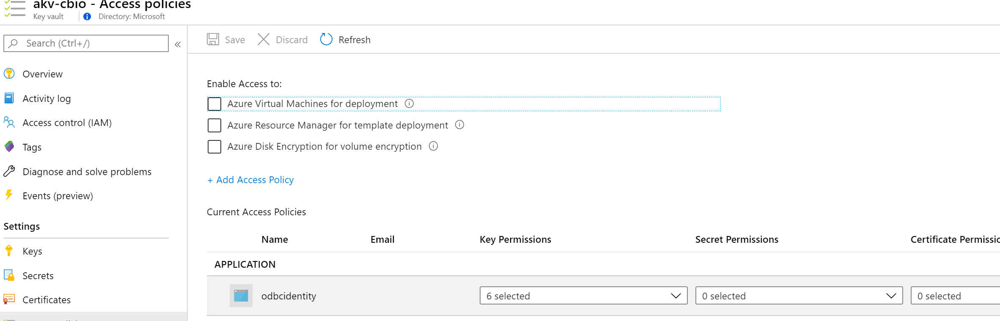

## Build image
Dockerfile is utilizing Multi Stage builds and is installing [MSSQL ODBC Driver 17](https://docs.microsoft.com/en-us/sql/connect/odbc/linux-mac/installing-the-microsoft-odbc-driver-for-sql-server?view=sql-server-2017) for Debian9 in the image .

```
docker build -t cloudquery .
docker run -d -p 8080:80 --name cloudquery cloudquery
docker exec -it cloudquery bash

docker login <REGISTRY_NAME>.azurecr.io
docker tag cloudquery <REGISTRY_NAME>.azurecr.io/cloudquery
docker push <REGISTRY_NAME>.azurecr.io/cloudquery
```

or using ACR

```
az login
az acr build --registry <REGISTRY_NAME> --image cloudquery:latest . 
```

## Kube Deployment

### Managing Server and DB
Deploy SQL Server and DB (update firewall as needed)
```
kubectl apply -f manifests/azure_v1_sqlserver.yaml
kubectl apply -f manifests/azure_v1_sqldatabase.yaml
kubectl apply -f manifests/azure_v1_sqlfirewall.yaml
```

Verify Secrets were created and Server is in Ready state

```
kubectl get secret sqlserver-query
kubectl describe azuresqlserver sqlserver-query
```

Secret will have SQL Server Admin user,fully qualified servername, username and password

```
$ kubectl get secret sqlserver-query -o yaml
apiVersion: v1
data:
  azuresqlservername: 
  fullyqualifiedservername: 
  fullyqualifiedusername: 
  password: 
  username: 
kind: Secret
metadata:
  creationTimestamp: "2019-10-25T01:24:31Z"
  name: sqlserver-query
```
### Managing DB and DBUsers only

Create Azure SQL Server outside the operator (ARM/Terraform/Powershell), now create Database using operator pointing to the name of the server (only logical name)

```
kubectl apply -f manifests/azure_v1_sqldatabase.yaml
```

Example Database yaml
```
apiVersion: azure.microsoft.com/v1alpha1
kind: AzureSqlDatabase
metadata:
  name: sqldatabase-sample465
spec:
  location: eastus2
  resourcegroup: search
  # Basic=0; Business=1; BusinessCritical=2; DataWarehouse=3; Free=4;
  # GeneralPurpose=5; Hyperscale=6; Premium=7; PremiumRS=8; Standard=9;
  # Stretch=10; System=11; System2=12; Web=13
  edition: 5
  server:  sqlserver-query # Name of the SERVER
 ``` 

Create secret with SQL Server Admin credentials - it will be used to provision DB User (will be in AKV in the future)

```
kubectl  \
    create secret generic sqlserver-query-adminsecret \
    --from-literal=azuresqlservername="sqlserver-query" \
    --from-literal=password="" \
    --from-literal=username="" \
```

Create DB User using operator

```
kubectl apply -f manifests/azure_v1_sqldbuser.yaml
```

Example DB User:

```
apiVersion: azure.microsoft.com/v1alpha1
kind: AzureSQLUser
metadata:
  name: sqldb-readonlyuser
spec:
  server: sqlserver-query
  dbname: sqldatabase-sample465
  adminsecret: sqlserver-query-adminsecret
  # possible roles:
  # db_owner, db_securityadmin, db_accessadmin, db_backupoperator, db_ddladmin, db_datawriter, db_datareader, db_denydatawriter, db_denydatareader
  roles:
    - "db_datareader"
```

Once DB and DB user finish provisioning, you will get a K8S secret object containing data to establish SQL connection:

```
$ k get secret sqldb-readonlyuser -o yaml
apiVersion: v1
data:
  password: 
  sqlservername: 
  sqlservernamespace: 
  username: 
kind: Secret
```

### Create Failover Group for GeoReplication

Create Secondary Azure SQL Server, and then create FailoverGroup using K8S CRD pointing to primary and secondary servers

```
apiVersion: azure.microsoft.com/v1alpha1
kind: AzureSqlFailoverGroup
metadata:
  name: azuresqlfog-sample
spec:
  location: eastus2
  resourcegroup: search
  server: sqlserver-query
  failoverpolicy: automatic
  failovergraceperiod: 30
  secondaryserver: sqlserver-query-secondary
  secondaryserverresourcegroup: search
  databaselist:
     - "sqldatabase-sample465"
```


### Deploy the Application

Deploy the app
```
kubectl apply -f manifests/k8-manifest.yaml
```

application is binding secrets to `"/etc/sqlservice"` path , to verify run cat command on the pod
```
$ k exec -it -n default cloudquery-web-xxxxxxx -- ls /etc/sqlservice
azuresqlservername        fullyqualifiedusername  username
fullyqualifiedservername  password
```

# Test the application

Navigate to LoadBalancer IP  to get to the application
```
kubectl get svc cloudquery-service
```

Click New and type database name prepended by `#`, application will read servername, user and password from mapped file paths when encountering `#` at the start of db name.


use simple query like `select 1` to verify connection

# Use Managed Identity for Connection
## install AAD Pod identity

ODBC driver (as well as JDBC and .NET SQL Client) suppports Azure Managed Identity to connect to Azure SQL.

To assign MSI to application running in K8S use [AAD Pod Identity](https://github.com/Azure/aad-pod-identity) project.

1. Install AAD Pod identity

```
kubectl apply -f https://raw.githubusercontent.com/Azure/aad-pod-identity/master/deploy/infra/deployment-rbac.yaml
```
2. Create Managed Identity and record the output Json
```
 az identity create -g <resourcegroup> -n <identityname> -o json
{
  "clientId": "e8e422cc-2bb7-4d06-ba43-cff38b07a026",
  "clientSecretUrl": "https://control-canadacentral.identity.azure.net/subscriptions/xxx",
  "id": "/subscriptions/xxx/resourcegroups/aks-tests/providers/Microsoft.ManagedIdentity/userAssignedIdentities/odbcidentity",
  "location": "canadacentral",
  "name": "odbcidentity",
  "principalId": "xxx",
  "resourceGroup": "xxx",
  "tags": {},
  "tenantId": "xxx",
  "type": "Microsoft.ManagedIdentity/userAssignedIdentities"
}
```

3. find what service Principal is used by AKS (or MSI if used in provisioing) and grand it access to manage Pod Managed Identity

```
az aks show -g <resourcegroup> -n <aksname>  | grep clientId
```

- grant AKS client access to MSI

```
az role assignment create --role "Managed Identity Operator" --assignee <aks clientid> --scope /subscriptions/<tenantId>/resourcegroups/<rg>/providers/Microsoft.ManagedIdentity/userAssignedIdentities/<MI name>
```

4. For simplicity Grant to Pod Identity Contributor role (should later grant only required access to sql and keyvault)

```
az role assignment create --role "Contributor" --assignee <identity clientId> --scope /subscriptions/<tenantId>/
```

5. grant Pod Identity MSI access to SQL Database ( typically add to AD group, here for simplicity admin)
```
az sql server ad-admin create --resource-group <resourceGroup> --server-name <sql server name> --display-name adminmsi --object-id <identity principalId>
```

6. Create Azure Pod Identity and Binding in K8S for the pods to use
```
 kubectl apply -f manifests/aadpodidentity.yaml
```
- Pod identity Manifests describing identity to bind to applications

```yaml
apiVersion: "aadpodidentity.k8s.io/v1"
kind: AzureIdentity
metadata:
  name: aksodbcpodidentity
spec:
  type: 0
  ResourceID: /subscriptions/<tenant>/resourcegroups/<rg>/providers/Microsoft.ManagedIdentity/userAssignedIdentities/<identityname>
  ClientID: <identity clientId>
--- 
apiVersion: "aadpodidentity.k8s.io/v1"
kind: AzureIdentityBinding
metadata:
  name: aksodbcpodidentity-binding
spec:
  AzureIdentity: "aksodbcpodidentity"
  Selector: "odbcidentity"
```

Now any Pod having label `aadpodidbinding: odbcidentity` will be bind to created MSI and will use it for MSI enabled calls

7. Update Kubernetes Manifest to add AAD Pod label and enable MSI for connection string, as example in  updated to have `aadpodidbinding` label:

```yaml
template:
    metadata:
      labels:
        app: cloudquery-web
        aadpodidbinding: odbcidentity
```
8. Update Environment variable for Pods to use MSI enabled connection string in code, in `manifests/k8-manifest.yaml`:

```yaml
    image: acraccess.azurecr.io/cloudquery:msi 
    imagePullPolicy: Always
    env:
    - name: MSI
      value: "true"  
```

As a result code in `EditorController.cs` will add `Authentication=ActiveDirectoryMsi` to connection string and `Uid` is `principalId` (or sometimes referred ad objectId) of the ManagedIdentity

```csharp
  if ( "true".equals(System.Environment.getEnvironmentVariable("MSI")) )
               connectionString = string.Format("Server=tcp:{0}.database.windows.net,1433;Database={1};Uid={2};Authentication=ActiveDirectoryMsi;Encrypt=yes;TrustServerCertificate=no;Connection Timeout=30;", conn.DBServer, conn.DBName, conn.Username, conn.Password);
 ```

 Read more in AAD settings for ODBC Driver in [Using Azure Active Directory with the ODBC Driver](https://docs.microsoft.com/en-us/sql/connect/odbc/using-azure-active-directory?view=sql-server-ver15)

 9. Apply manifest and run in the AKS, verify by a providing server, db name and MSI principal id - connection should succeed ( run for example `Select 1`) 
 ```
 kubectl apply -f manifests/k8-manifest.yaml
 ```


# Use Managed Identity in ODBC for AlwaysEncrypted
First follow the steps in previous chapted to enable AAD Pod Identity and MSI Authentication in ODBC driver connection.

To use MSI identity as part of Always Encrypted connection to KeyVault, use beta driver
installed in this repo `Dockerfile`

1. In this repo we have Debian and RedHat distros of the driver and add to `Dockerfile`
```
COPY msodbcsql_17.5.1.2-1_amd64.deb ./msodbcsql_17.5.1.2-1_amd64.deb
RUN ACCEPT_EULA=Y apt-get  -y --no-install-recommends  install ./msodbcsql_17.5.1.2-1_amd64.deb
```
2. To use MSI when connecting to KeyVault and enable AlwaysEncrypted add to connection string `ColumnEncryption=Enabled;KeyStoreAuthentication=KeyVaultManagedIdentity;KeyStorePrincipalId={2}` where `KeyStorePrincipalId` is assigned to MSI Identity principal Id. Example in `EditorController.cs` 

```
if ( "true".equals(System.Environment.getEnvironmentVariable("ODBC_ALWAYSENCRYPTED")))
    connectionString = string.Format("Server=tcp:{0}.database.windows.net,1433;Database={1};Uid={2};Authentication=ActiveDirectoryMsi;Encrypt=yes;TrustServerCertificate=no;Connection Timeout=30;ColumnEncryption=Enabled;KeyStoreAuthentication=KeyVaultManagedIdentity;KeyStorePrincipalId={2}", conn.DBServer, conn.DBName, conn.Username, conn.Password);
```            
and enable   `ODBC_ALWAYSENCRYPTED` variable in K8S manifest, see example in `manifests/k8s-manifest.yaml`

Read more in AAD settings for ODBC Driver in [Using Azure Active Directory with the ODBC Driver](https://docs.microsoft.com/en-us/sql/connect/odbc/using-azure-active-directory?view=sql-server-ver15)

2. Create KyeVault and grant to MSI Identity access policy to use the Master Key in the vault

```
az keyvault set-policy --name <vaultname> --key-permissions get list sign unwrapKey verify wrapKey --resource-group   php --spn <identity clientId>
```


3. Apply Always Encrypted settings on the column in DB (use SSMS)

create table with data and use SSMS as described here to create CMK/CEK and alter table
[Always Encrypted: Protect sensitive data and store encryption keys in Azure Key Vault](https://docs.microsoft.com/en-us/azure/sql-database/sql-database-always-encrypted-azure-key-vault?tabs=azure-cli). Example script generated  by the wizard could be found at `encrypt.ps1`

```sql
CREATE TABLE Persons (
    PersonID int,
    LastName varchar(255),
    FirstName varchar(255),
    Address varchar(255),
    City varchar(255)
);

insert into Persons values (1, 'Smith','John', '222 bay', 'toronto');
insert into Persons values (1, 'Smith','Jake', '222 bay', 'toronto');
insert into Persons values (1, 'Lannister','Tyrion', '222 bay', 'toronto');
```
Go thru wizard


as a result data will be enctypted in db and you'll see CMK provisioned in the vault.


4. Deploy and test K8S app
 ```
 kubectl apply -f manifests/k8-manifest.yaml
 ```


# Sample T-SQL to provision CMK/CEK in code
To encrypt columns using T-SQL refer to article: [CREATE COLUMN MASTER KEY](https://docs.microsoft.com/en-us/sql/t-sql/statements/create-column-master-key-transact-sql?view=sql-server-ver15) and [ALTER COLUMN ENCRYPTION KEY](https://docs.microsoft.com/en-us/sql/t-sql/statements/alter-column-encryption-key-transact-sql?view=sql-server-ver15)

Process will envolve following steps:
1. Create Master Key

```sql
CREATE COLUMN MASTER KEY MyCMK  
WITH (  
    KEY_STORE_PROVIDER_NAME = N'AZURE_KEY_VAULT',  
    KEY_PATH = N'https://<vaultname>.vault.azure.net:443/keys/  
        MyCMK/'); 
```
2. Create Column Encryption Key

```sql
CREATE COLUMN ENCRYPTION KEY MyCEK 
WITH VALUES  (
  COLUMN_MASTER_KEY = MyCMK,
  ALGORITHM = 'RSA_OAEP',
  ENCRYPTED_VALUE = '<encryptedKeySerialized>')
```

Where encrypted value calculated in code example C#:

```csharp
  SqlColumnEncryptionAzureKeyVaultProvider kvProvider =
                 new SqlColumnEncryptionAzureKeyVaultProvider(
                     KyvosKeyVaultService.GetKeyVaultClientAuthCallback(tenantId, clientId, clientSecret));

    byte[] cekRawValue = new byte[32];
    RandomNumberGenerator csprng = new RNGCryptoServiceProvider();
    csprng.GetBytes(cekRawValue);

    string mekPath="https://<vaultname>.vault.azure.net:443/keys/MyCMK/";
    byte[] cekEncryptedValue = kvProvider.EncryptColumnEncryptionKey(mekPath, @"RSA_OAEP", cekRawValue);
    var encryptedKeySerialized = "0x" + BitConverter.ToString(cekEncryptedValue.Replace("-", "");
```