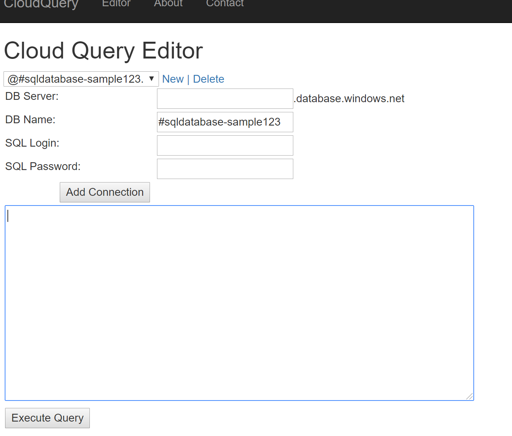

## Build image
Dockerfile is utilizing Multi Stage builds and is installing [MSSQL ODBC Driver 17](https://docs.microsoft.com/en-us/sql/connect/odbc/linux-mac/installing-the-microsoft-odbc-driver-for-sql-server?view=sql-server-2017) for Debian9 in the image .

```
docker build -t cloudquery .
docker run -d -p 8080:80 --name cloudquery cloudquery
docker exec -it cloudquery bash

docker login <REGISTRY_NAME>.azurecr.io
docker tag cloudquery <REGISTRY_NAME>.azurecr.io/cloudquery
docker push <REGISTRY_NAME>.azurecr.io/cloudquery
```

or using ACR

```
az login
az acr build --registry <REGISTRY_NAME> --image cloudquery:latest . 
```

## Kube Deployment

### Managing Server and DB
Deploy SQL Server and DB (update firewall as needed)
```
kubectl apply -f manifests/azure_v1_sqlserver.yaml
kubectl apply -f manifests/azure_v1_sqldatabase.yaml
kubectl apply -f manifests/azure_v1_sqlfirewall.yaml
```

Verify Secrets were created and Server is in Ready state

```
kubectl get secret sqlserver-query
kubectl describe azuresqlserver sqlserver-query
```

Secret will have SQL Server Admin user,fully qualified servername, username and password

```
$ kubectl get secret sqlserver-query -o yaml
apiVersion: v1
data:
  azuresqlservername: 
  fullyqualifiedservername: 
  fullyqualifiedusername: 
  password: 
  username: 
kind: Secret
metadata:
  creationTimestamp: "2019-10-25T01:24:31Z"
  name: sqlserver-query
```
### Managing DB and DBUsers only

Create Azure SQL Server outside the operator (ARM/Terraform/Powershell), now create Database using operator pointing to the name of the server (only logical name)

```
kubectl apply -f manifests/azure_v1_sqldatabase.yaml
```

Example Database yaml
```
apiVersion: azure.microsoft.com/v1alpha1
kind: AzureSqlDatabase
metadata:
  name: sqldatabase-sample465
spec:
  location: eastus2
  resourcegroup: search
  # Basic=0; Business=1; BusinessCritical=2; DataWarehouse=3; Free=4;
  # GeneralPurpose=5; Hyperscale=6; Premium=7; PremiumRS=8; Standard=9;
  # Stretch=10; System=11; System2=12; Web=13
  edition: 5
  server:  sqlserver-query # Name of the SERVER
 ``` 

Create secret with SQL Server Admin credentials - it will be used to provision DB User (will be in AKV in the future)

```
kubectl  \
    create secret generic sqlserver-query-adminsecret \
    --from-literal=azuresqlservername="sqlserver-query" \
    --from-literal=password="" \
    --from-literal=username="" \
```

Create DB User using operator

```
kubectl apply -f manifests/azure_v1_sqldbuser.yaml
```

Example DB User:

```
apiVersion: azure.microsoft.com/v1alpha1
kind: AzureSQLUser
metadata:
  name: sqldb-readonlyuser
spec:
  server: sqlserver-query
  dbname: sqldatabase-sample465
  adminsecret: sqlserver-query-adminsecret
  # possible roles:
  # db_owner, db_securityadmin, db_accessadmin, db_backupoperator, db_ddladmin, db_datawriter, db_datareader, db_denydatawriter, db_denydatareader
  roles:
    - "db_datareader"
```

Once DB and DB user finish provisioning, you will get a K8S secret object containing data to establish SQL connection:

```
$ k get secret sqldb-readonlyuser -o yaml
apiVersion: v1
data:
  password: 
  sqlservername: 
  sqlservernamespace: 
  username: 
kind: Secret
```

### Create Failover Group for GeoReplication

Create Secondary Azure SQL Server, and then create FailoverGroup using K8S CRD pointing to primary and secondary servers

```
apiVersion: azure.microsoft.com/v1alpha1
kind: AzureSqlFailoverGroup
metadata:
  name: azuresqlfog-sample
spec:
  location: eastus2
  resourcegroup: search
  server: sqlserver-query
  failoverpolicy: automatic
  failovergraceperiod: 30
  secondaryserver: sqlserver-query-secondary
  secondaryserverresourcegroup: search
  databaselist:
     - "sqldatabase-sample465"
```


### Deploy the Application

Deploy the app
```
kubectl apply -f manifests/k8-manifest.yaml
```

application is binding secrets to `"/etc/sqlservice"` path , to verify run cat command on the pod
```
$ k exec -it -n default cloudquery-web-xxxxxxx -- ls /etc/sqlservice
azuresqlservername        fullyqualifiedusername  username
fullyqualifiedservername  password
```

# Test the application

Navigate to LoadBalancer IP  to get to the application
```
kubectl get svc cloudquery-service
```

Click New and type database name prepended by `#`, application will read servername, user and password from mapped file paths when encountering `#` at the start of db name.



use simple query like `select 1` to verify connection